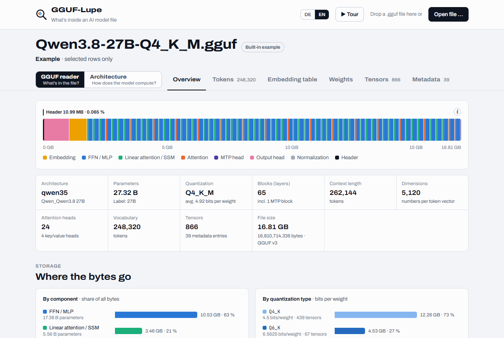
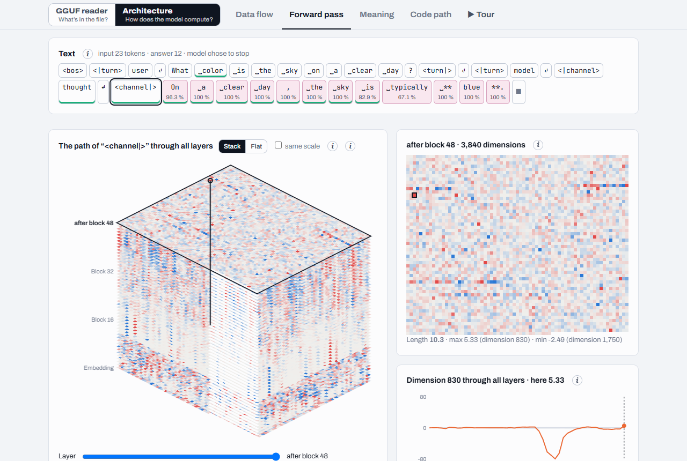

# GGUF-Lupe

**English** · [Deutsch](README.de.md)

A beginner-friendly look inside any `.gguf` model file: what's stored in it, and how the model computes.



## Try it

**Online:** <https://themoxl.github.io/gguf-lupe/>. It's the same page: your file stays in your browser.

**Or locally:**

1. Open `gguf-lupe.html` in your browser.
2. Drag a `.gguf` file into the window, or click **Open file**.

- Nothing is uploaded. The page reads only the parts it shows, so file size doesn't matter.
- No install, no server, no GPU. Works offline.
- Without a file, a built-in demo shows Qwen3.8-27B (header, selected rows, full token map).
- German or English, based on your browser language. Switch with **DE/EN** in the header.
- Explanations sit behind the **ⓘ** buttons.

## What you see

**GGUF reader** · *What's in the file?*

- **Overview**
- **Tokens**: vocabulary, merge rules, special tokens, splitting a text step by step
- **Embedding table**
- **Weights**: every weight table, as numbers
- **Tensors**: the tensor directory
- **Metadata**: every key-value pair

**Architecture** · *How does the model compute?*

- **Data flow**: the path through the blocks
- **Forward pass**: a real run with every step (live with the server, or a recorded example)
- **Meaning**: similar words, word arithmetic (King − man + woman), a map of all tokens
- **Code path**: the same computation in the llama.cpp source code
- **Tour**: your sentence through the model, step by step, full screen

## Optional: the Lupe server

A small Python program on your own computer that computes on GPU or CPU. It adds:

- **Live forward pass**: ask a question and follow every step for every token
- **Full token map** for any model (computed once, then cached)
- **Dimension layers** on the map: any column of the embedding table, or the principal directions
- **Similar words and word arithmetic** over all tokens, in a fraction of a second
- **Model list**: the `.gguf` files in your model folders, one click to open

### Requirements

- Python 3.9+ with `numpy` and `gguf`: `pip install numpy gguf`
- Optional: [PyTorch](https://pytorch.org), for NVIDIA GPUs (CUDA), Apple chips (MPS) or a faster CPU

With conda:

```
conda create -n gguf-lupe python=3.12 numpy
conda activate gguf-lupe
pip install gguf
```

A GPU is optional: the CPU gives the same result, just slower (full token map of Qwen3.8-27B: ~2 min on an RTX 5090, ~24 min on 16 CPU cores).

### Start

- **Windows:** double-click `start-lupe-server.cmd` (it also finds a conda env named `gguf-lupe`)
- **macOS / Linux:** `./start-lupe-server.sh`

Your browser opens `http://127.0.0.1:8765/`. At the top, pick GPU or CPU and your model, then open it. Until then the page shows the demo.

```
python src/lupe_server.py [--port 8765] [--device auto|gpu|cuda|mps|cpu] [--models DIR ...] [--no-browser]
```

`--models` adds folders to the default search: `~/.lmstudio/models`, `~/.cache/lm-studio/models`, `~/.cache/huggingface/hub`, `~/models`, `~/Downloads`. The start scripts pass options on. Another Python: `LUPE_PYTHON` or `lupe-python.txt` (see the start scripts).

### Forward pass and llama.cpp

On first use, the **Forward pass** tab offers buttons that download the official llama.cpp release **b11388** (the version the **Code path** tab shows) from GitHub into `~/.cache/gguf-lupe/llama.cpp-b11388/`:

| Build | For | Size |
|---|---|---|
| CUDA | NVIDIA GPUs | ~580 MB |
| Vulkan | NVIDIA, AMD and Intel GPUs | ~33 MB |
| CPU | no GPU | ~19 MB |

By hand: unpack the archive from the [b11388 release](https://github.com/ggml-org/llama.cpp/releases/tag/b11388) into `llama.cpp/` next to `gguf-lupe.html`, or into the cache folder above. For CUDA, add the `cudart-…` archive to the same folder.

The model always picks the most likely token (same question, same answer; question + answer: at most 100 tokens). Then the whole text runs again while every step of llama.cpp's real compute graph is recorded. You see:

- each token's path through all layers (3D stack) and the logit lens (the prediction after each layer)
- attention per head, and the next token with probabilities
- every step of a block; click a number to recompute it: inputs × weight row from the file



## Which files work?

Any `.gguf` file, any size. Tested with language models (Qwen3.8 27B, Gemma 4 12B) and vision encoders (mmproj files). Limits:

- **Weights as numbers:** all common formats (F32, F16, BF16, Q4_0 to Q8_0, Q2_K to Q6_K, IQ4_NL, IQ4_XS, MXFP4, NVFP4 …). IQ1, IQ2, IQ3, TQ1_0, Q1_0: shape and size only, no numbers yet.
- **Splitting text step by step:** BPE tokenizers (Qwen, Llama 3, Mistral Nemo, GPT-style …) and Gemma 4. Other tokenizers: vocabulary only.
- **Forward pass:** every architecture llama.cpp b11388 knows (about 150). Vision encoders and other files without a vocabulary can be read but not run.
- **Split models** (`…-00001-of-00003.gguf`): each part can be read on its own. For the forward pass, open the first part.

## Recorded examples

Real forward passes recorded with llama.cpp, at the top of the **Forward pass** tab. Viewing needs only the page, no server or GPU. Included: runs in German and English. Keep `examples/` next to `gguf-lupe.html`.

**Make your own:** with the server, run a question and click **Save as example**. The file (about 5 to 12 MB) goes into `examples/` and appears in the list. Or, with the server running (the model must be in one of its model folders):

```
python src/make_example.py "Question" --model PATH-TO.gguf
```

## Privacy and storage

- The server listens only on `127.0.0.1` and reads only `.gguf` files in its model folders. Nothing is uploaded or copied.
- The page loads nothing from the internet (even the fonts are built in). The server goes online only for the llama.cpp download, when you click it.

| What | Where |
|---|---|
| Computed maps | `~/.cache/gguf-lupe/*.lupe-map.bin`, one per model file; delete anytime |
| llama.cpp | `~/.cache/gguf-lupe/llama.cpp-b11388/` (or `llama.cpp/` next to `gguf-lupe.html`) |
| Last 30 models, device, language | browser `localStorage`: `lupe-model-history`, `lupe-device`, `lupe-lang` |
| Recorded runs | memory only (last 4); on disk only if saved as an example |

`~` is your home folder (Windows: `C:\Users\<name>`).

## Build from source

`gguf-lupe.html` is assembled from `src/`. Needs Node.js, no packages:

```
cd src
node build.cjs ../gguf-lupe.html
```

## Credits and licenses

- Own code: MIT, see [LICENSE](LICENSE).
- [llama.cpp](https://github.com/ggml-org/llama.cpp) (MIT, © 2023-2026 The ggml authors): the **Code path** tab embeds unmodified source files of release b11388, with the license text viewable in the page. Tokenizer, weight decoding and code path follow the same version. The llama.cpp binaries for the forward pass are official releases, downloaded from GitHub at runtime, not part of this repo.
- The built-in demo and the recorded examples contain data derived from Qwen3.8-27B and Gemma 4 12B (both Apache-2.0, GGUF files from lmstudio-community).
- Fonts: Archivo and JetBrains Mono (SIL Open Font License 1.1), embedded in the page.
- All third-party notices: [NOTICE.md](NOTICE.md).
